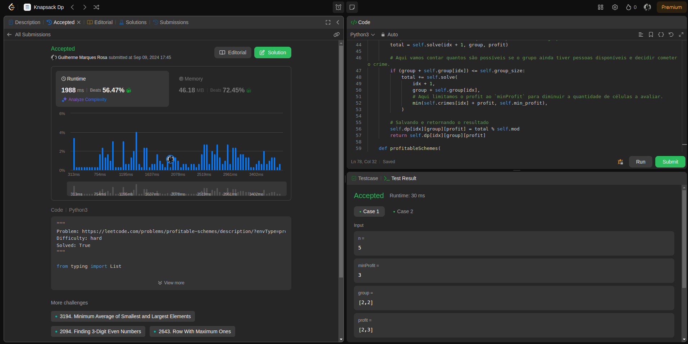
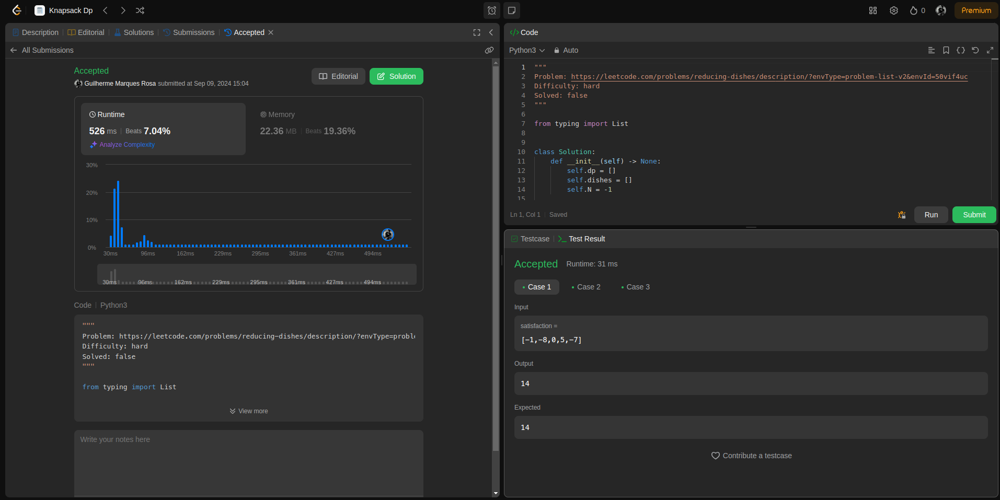

# Questões LeetCode

## Alunos
|Matrícula | Aluno |
| -- | -- |
| 16/0007739  |  Guilherme Marques Rosa |

## Sobre 
O trabalho consiste da seleção de problemas do [LeetCode](https://leetcode.com) com nível `hard` que abordem o tema de Programação Dinâmica.

## Screenshots

### 879. Profitable Schemes

### 1402. Reducing Dishes

## Instalação 
**Linguagem**: Python 

Para instalar qualquer dependência basta executar o comando: `poetry install` na reiz do projeto

## Uso 
Dentro do diretório `problems` estão as soluções dos problemas separados em diferentes arquivos.

Para averiguar a solução, basta seguir o link do problema que está citado no topo do arquivo, copiar o código no editor e submeter a solução.

